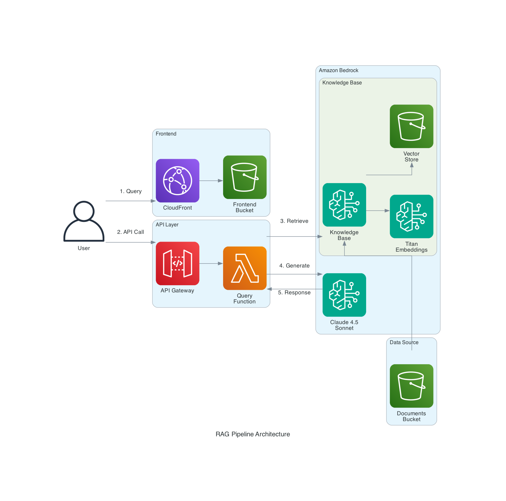

# Presentation Slides: Prompt Engineering & Context Management

## Slide 1: Title
**Week 3: Prompt Engineering & Context Management**
**Building Production RAG Workflows for Enterprise Support**

AWS Enterprise Support School of GenAI
Level: 200-300 (Intermediate/Advanced)

## Slide 2: Learning Objectives
By the end of this session, you will:
- Master advanced prompt engineering strategies and when to apply each
- Understand embedding mathematics and vector similarity algorithms
- Build and optimize a RAG pipeline using Amazon Bedrock Knowledge Bases
- Apply chunking strategies and retrieval tuning for production workloads
- Evaluate RAG performance with quantitative metrics

## Slide 3: Recap - Building on Foundations
**Week 1:** Generative AI Fundamentals
- Transformer architecture, attention mechanisms
- Foundation model capabilities and limitations

**Week 2:** Bedrock Implementation
- API integration patterns
- Basic knowledge base concepts

**Today:** Production-grade RAG with advanced prompt engineering

## Slide 4: The Enterprise Challenge
**Why vanilla LLMs fall short for Enterprise Support**

| Challenge | Impact | Solution |
|-----------|--------|----------|
| Knowledge cutoff | Outdated service info | RAG with current docs |
| No org context | Generic responses | Domain-specific KB |
| Hallucination | Incorrect guidance | Grounded generation |
| Token limits | Truncated context | Smart retrieval |

**Key insight:** RAG transforms LLMs from general assistants to domain experts

## Slide 5: Prompt Engineering Deep Dive
**Beyond basic prompting**

Prompt engineering is systematic optimization of LLM inputs:
- **Instruction tuning:** Precise task specification
- **Context injection:** Relevant information placement
- **Output formatting:** Structured response control
- **Constraint setting:** Guardrails and boundaries

**TAM Application:** Consistent, accurate customer guidance

## Slide 6: Zero-Shot Prompting
**Direct instruction without examples**

```python
system_prompt = """You are an AWS Enterprise Support specialist.
Respond with:
1. Root cause analysis
2. Immediate remediation steps
3. Long-term prevention recommendations
Format: Structured markdown with headers."""

user_query = "Customer's Lambda function is being throttled"
```

**When to use:**
- Well-defined tasks with clear outputs
- Model has strong domain training
- Speed is priority over precision

**Limitation:** Less control over response format

## Slide 7: Few-Shot Prompting
**Pattern learning through examples**

```python
system_prompt = """You are an AWS Enterprise Support specialist.
Follow this response pattern:

Example 1:
Q: EC2 instance unreachable
A: ## Diagnosis
   - Check instance status checks
   - Verify security group rules
   ## Resolution
   - [Specific steps]
   ## Prevention
   - Enable detailed monitoring

Now respond to the user's question using the same format."""
```

**When to use:**
- Specific output formatting required
- Domain-specific terminology
- Consistent response structure across queries

## Slide 8: Chain-of-Thought (CoT) Prompting
**Explicit reasoning for complex problems**

```python
system_prompt = """You are an AWS Enterprise Support specialist.
For complex issues, reason step-by-step:

1. UNDERSTAND: What is the customer experiencing?
2. HYPOTHESIZE: What are possible root causes?
3. INVESTIGATE: What data points would confirm/deny each?
4. DIAGNOSE: Based on evidence, what's the likely cause?
5. RESOLVE: What are the remediation steps?
6. PREVENT: How do we avoid recurrence?

Show your reasoning at each step."""
```

**Research shows:** CoT improves accuracy on complex reasoning tasks by 20-40%

## Slide 9: Role-Based Prompting with Constraints
**Persona + guardrails for production**

```python
system_prompt = """You are a Technical Account Manager (TAM) at AWS 
with 10+ years of Enterprise Support experience.

EXPERTISE: Well-Architected Framework, incident response, cost optimization
TONE: Professional, empathetic, solution-focused
CONSTRAINTS:
- Never recommend unsupported configurations
- Always cite AWS documentation when available
- Escalate security concerns immediately
- Include relevant service limits

When uncertain, acknowledge limitations and suggest escalation paths."""
```

**Production tip:** Combine role-based with explicit constraints for safety

## Slide 10: Prompt Strategy Selection Matrix
**Matching strategy to task complexity**

| Scenario | Strategy | Why |
|----------|----------|-----|
| Service limit increase | Zero-shot | Well-defined process |
| Multi-service outage | CoT | Complex diagnosis needed |
| Customer communication | Role-based | Consistent tone |
| Case documentation | Few-shot | Specific format |
| Architecture review | CoT + Role | Complex + expertise |

**Advanced:** Combine strategies for production prompts

## Slide 11: Embeddings - The Mathematics
**Vector representations of semantic meaning**

Embeddings map text to high-dimensional vectors where:
- **Semantic similarity → Vector proximity**
- **Cosine similarity:** cos(θ) = (A·B)/(||A||×||B||)

```python
# Titan Embeddings V2 output
"EC2 instance limit"  → [0.23, -0.45, 0.12, ...] # 1024 dims
"compute capacity"    → [0.21, -0.43, 0.14, ...] # Similar!
"S3 bucket policy"    → [-0.15, 0.67, -0.33, ...] # Different
```

**Key insight:** Embeddings capture meaning, not just keywords

## Slide 12: Vector Similarity Algorithms
**How retrieval actually works**

| Algorithm | Complexity | Use Case |
|-----------|------------|----------|
| Cosine Similarity | O(d) | Normalized vectors |
| Euclidean Distance | O(d) | Absolute distances |
| Dot Product | O(d) | Magnitude matters |
| HNSW (Approximate) | O(log n) | Large-scale search |

**OpenSearch Serverless uses:** HNSW for efficient approximate nearest neighbor search

```
Similarity Score = 1 - (cosine_distance / 2)
Range: 0.0 (opposite) to 1.0 (identical)
```

## Slide 13: Vector Database Architecture
**Production considerations**

| Service | Indexing | Query Latency | Scale |
|---------|----------|---------------|-------|
| OpenSearch Serverless | Automatic | <100ms | Millions |
| Aurora pgvector | Manual | <50ms | Millions |
| Pinecone | Automatic | <20ms | Billions |
| Redis Vector | Manual | <10ms | Millions |

**Bedrock KB default:** OpenSearch Serverless (managed, scalable)

**Trade-offs:** Latency vs. cost vs. operational overhead

## Slide 14: Embedding Model Comparison
**Choosing the right model**

| Model | Dimensions | Max Tokens | Multilingual | Cost |
|-------|------------|------------|--------------|------|
| Titan V2 | 256/512/1024 | 8,192 | Limited | $ |
| Cohere Embed v3 | 1024 | 512 | 100+ languages | $$ |
| Cohere Embed Multilingual | 1024 | 512 | Optimized | $$ |

**Dimension trade-off:**
- Higher dims → Better semantic capture → More storage/compute
- 1024 dims is sweet spot for most use cases

**TAM tip:** Use Titan V2 for English-only, Cohere for multilingual customers

## Slide 15: RAG vs Fine-Tuning
**When to use each approach**

| Aspect | RAG | Fine-Tuning |
|--------|-----|-------------|
| Knowledge updates | Real-time | Requires retraining |
| Cost | Per-query retrieval | Upfront training |
| Accuracy | High with good KB | Depends on data |
| Hallucination | Reduced (grounded) | Can still occur |
| Setup time | Hours | Days/weeks |

**Enterprise Support recommendation:** RAG for most use cases
- Knowledge changes frequently
- Need citation/attribution
- Faster time to production

## Slide 16: RAG Pipeline Architecture
**Production-grade flow**



**Key Components:**
| Component | Service | Purpose |
|-----------|---------|---------|
| Frontend | CloudFront + S3 | Secure static hosting |
| API | API Gateway + Lambda | Query routing |
| Knowledge Base | Bedrock KB | Retrieval |
| Vector Store | S3 Vectors | Embeddings storage |
| Generation | Claude 4.5 Sonnet | Response generation |

**This is a reusable pattern** — fork the repo, swap the docs, deploy for your team.

See: [docs/RAG_REFERENCE_ARCHITECTURE.md](docs/RAG_REFERENCE_ARCHITECTURE.md)

## Slide 17: Bedrock Knowledge Bases - Under the Hood
**What the managed service handles**

**Ingestion:**
1. Document parsing (PDF, TXT, HTML, MD, CSV, DOCX)
2. Chunking with configurable strategy
3. Embedding generation (batched)
4. Vector indexing with metadata

**Query:**
1. Query embedding
2. Hybrid search (semantic + keyword)
3. Re-ranking (optional)
4. Context assembly
5. Generation with citations

**You configure:** Chunking params, retrieval count, prompt template

## Slide 18: Chunking Strategies Deep Dive
**Critical for retrieval quality**

| Strategy | Config | Pros | Cons |
|----------|--------|------|------|
| Fixed size | 300 tokens, 10% overlap | Simple, predictable | May split context |
| Semantic | Sentence boundaries | Preserves meaning | Variable sizes |
| Hierarchical | Parent/child chunks | Best of both | Complex setup |

**Bedrock defaults:**
- `maxTokens`: 300

See: [How content chunking works](https://docs.aws.amazon.com/bedrock/latest/userguide/kb-chunking.html)
- `overlapPercentage`: 10%

**Tuning tip:** Start with defaults, adjust based on retrieval quality

```python
# Bedrock KB chunking config
chunkingConfiguration = {
    "chunkingStrategy": "FIXED_SIZE",
    "fixedSizeChunkingConfiguration": {
        "maxTokens": 300,
        "overlapPercentage": 10
    }
}
```

## Slide 19: Retrieval Optimization
**Tuning for accuracy**

**Key parameters:**
- `numberOfResults`: 3-10 (default: 5)
- `searchType`: SEMANTIC | HYBRID

**Hybrid search combines:**
- Semantic similarity (embeddings)
- Keyword matching (BM25)

```python
retrievalConfiguration = {
    "vectorSearchConfiguration": {
        "numberOfResults": 5,
        "overrideSearchType": "HYBRID"
    }
}
```

**When to use HYBRID:** Technical docs with specific terms (error codes, ARNs)

## Slide 20: Context Window Management
**Fitting retrieval into generation**

| Model | Context Window | Effective for RAG |
|-------|----------------|-------------------|
| Claude 4.5 Sonnet | 200K tokens | ~150K usable |
| Claude 3 Haiku | 200K tokens | ~150K usable |

**Context budget:**
- System prompt: ~500 tokens
- Retrieved chunks: 5 × 300 = 1,500 tokens
- User query: ~100 tokens
- Response: ~2,000 tokens
- **Total:** ~4,100 tokens (well within limits)

**Advanced:** Use summarization for very long contexts

## Slide 21: Hands-On Exercise Overview
**Building a Production RAG Workflow**

You'll build a RAG system for Enterprise Support case resolution:

| Component | Technology | Purpose |
|-----------|------------|---------|
| Knowledge Base | S3 + Bedrock KB | Store support docs |
| Vector Store | OpenSearch Serverless | Semantic search |
| Embeddings | Titan V2 | Document/query encoding |
| Generation | Claude 4.5 Sonnet | Response generation |
| Interface | RAG Playground (Web UI) | Testing & comparison |

**Time:** 60 minutes

## Slide 22: Exercise Architecture
**What you're deploying**

```
┌─────────────────────────────────────────────────────────────────┐
│                    CloudFormation Stack                          │
├─────────────────────────────────────────────────────────────────┤
│                                                                  │
│  ┌──────────────┐    ┌──────────────┐    ┌──────────────┐       │
│  │ S3 Bucket    │    │ Lambda       │    │ API Gateway  │       │
│  │ (KB Content) │    │ (Query Fn)   │    │ (HTTP API)   │       │
│  └──────────────┘    └──────────────┘    └──────────────┘       │
│         │                   │                   │                │
│         ↓                   ↓                   ↓                │
│  ┌──────────────┐    ┌──────────────┐    ┌──────────────┐       │
│  │ Bedrock KB   │ ←→ │ OpenSearch   │    │ S3 Frontend  │       │
│  │ (Manual)     │    │ Serverless   │    │ (Web UI)     │       │
│  └──────────────┘    └──────────────┘    └──────────────┘       │
│                                                                  │
└─────────────────────────────────────────────────────────────────┘
```

## Slide 23: RAG Playground Demo
**Web UI for prompt engineering experiments**

Features:
- **Compare Mode:** Side-by-side RAG vs Direct responses
- **Prompt Styles:** Zero-shot, Few-shot, CoT, Role-based
- **Citations:** See which documents were retrieved
- **Real-time:** Instant feedback on prompt changes

**Key experiment:** Same query, different prompt styles → Different quality

## Slide 24: RAG Evaluation Metrics
**Measuring success quantitatively**

| Metric | What it measures | Target |
|--------|------------------|--------|
| Retrieval Precision | Relevant chunks / Retrieved | >80% |
| Answer Relevance | Response addresses query | >90% |
| Faithfulness | Response grounded in context | >95% |
| Latency | End-to-end response time | <3s |

**Evaluation approach:**
1. Create test query set (20-50 queries)
2. Define expected answers
3. Run automated evaluation
4. Iterate on chunking/retrieval params

## Slide 25: Production Best Practices
**From POC to production**

1. **Content Quality**
   - Structured, well-formatted documents
   - Regular updates and sync
   - Metadata for filtering

2. **Retrieval Tuning**
   - A/B test chunk sizes
   - Hybrid search for technical content
   - Monitor retrieval quality

3. **Prompt Engineering**
   - Version control prompts
   - Test across query types
   - Include guardrails

4. **Monitoring**
   - Track latency, errors, costs
   - Log queries for improvement
   - User feedback loop

## Slide 26: Q&A and Resources
**Questions?**

**Resources:**
- Exercise Guide: `exercise-guide.md`
- RAG Playground: Deployed web UI
- Prompt Examples: `prompts/` directory
- AWS Docs: [Bedrock Knowledge Bases](https://docs.aws.amazon.com/bedrock/latest/userguide/knowledge-base.html)

**Next Steps:**
1. Complete hands-on exercise (60 min)
2. Kahoot quiz (15 min)
3. Apply to your customer scenarios!

**Week 4 Preview:** Agents, Tool Use, and Multi-step Reasoning
